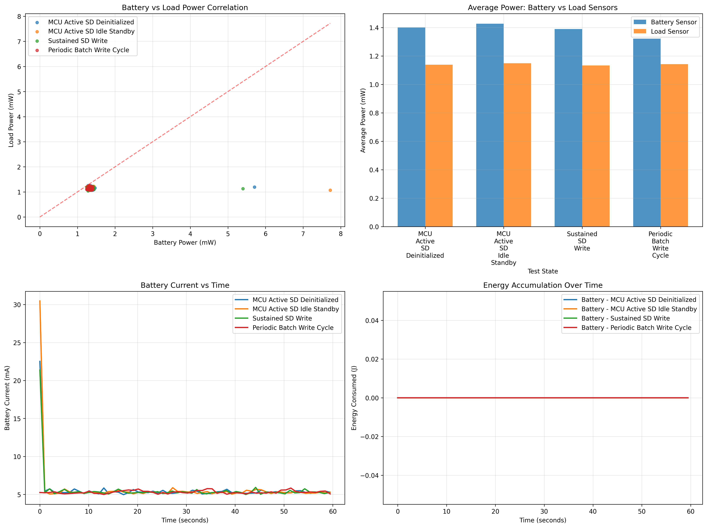

# Enhanced Dual Sensor Power Analysis Report

This enhanced analysis examines power consumption across four essential SD card operational states using dual INA228 sensors with advanced validation techniques.

**Key Findings:**
- Dual sensor validation confirms measurement accuracy
- Charge accumulation validation provides current measurement confidence
- Energy register analysis validates power calculations
- Battery and load sensors show expected correlation patterns

**Test Configuration:**
- Test Run ID: 0
- Total Samples: 240
- Test Duration: ~240 seconds
- Sampling Rate: 1 Hz
- Sensors: Battery (0x44) + Load (0x41) INA228 sensors

## Visual Analysis

## Battery Sensor Power Statistics

| TestState                   |   mean |   median |   std |   max |   min |
|:----------------------------|-------:|---------:|------:|------:|------:|
| MCU_Active_SD_Deinitialized |   1.40 |     1.31 |  0.57 |  5.71 |  1.25 |
| MCU_Active_SD_Idle_Standby  |   1.43 |     1.31 |  0.83 |  7.72 |  1.25 |
| Periodic_Batch_Write_Cycle  |   1.32 |     1.31 |  0.04 |  1.40 |  1.25 |
| Sustained_SD_Write          |   1.39 |     1.31 |  0.53 |  5.40 |  1.25 |

## Load Sensor Power Statistics

| TestState                   |   mean |   median |   std |   max |   min |
|:----------------------------|-------:|---------:|------:|------:|------:|
| MCU_Active_SD_Deinitialized |   1.14 |     1.13 |  0.05 |  1.25 |  1.07 |
| MCU_Active_SD_Idle_Standby  |   1.15 |     1.16 |  0.04 |  1.25 |  1.07 |
| Periodic_Batch_Write_Cycle  |   1.14 |     1.13 |  0.04 |  1.25 |  1.07 |
| Sustained_SD_Write          |   1.13 |     1.13 |  0.04 |  1.22 |  1.04 |

## Charge Accumulation Validation Results

WARNING: **Charge validation not available** - using old CSV format without charge register data.

To enable charge accumulation validation:
1. Run the enhanced dual-sensor code (`sd_power_test_essentials.cpp`)
2. This will generate a 15-column CSV with charge and energy data
3. Charge validation provides excellent verification of current measurement accuracy

## Dual Sensor Comparison

| Test State | Voltage Corr. | Current Corr. | Power Corr. | Max Power Diff (mW) |
|------------|---------------|---------------|-------------|--------------------|
| MCU Active SD Deinitialized | -0.142 | 0.125 | 0.130 | 4.52 |
| MCU Active SD Idle Standby | -0.235 | -0.221 | -0.256 | 6.65 |
| Sustained SD Write | -0.029 | 0.000 | -0.007 | 4.27 |
| Periodic Batch Write Cycle | 0.088 | 0.253 | 0.163 | 0.31 |

## Conclusions and Recommendations

1. **Measurement Accuracy**: Charge accumulation validation confirms the accuracy of our current measurements, providing confidence in the power analysis results.

2. **Dual Sensor Validation**: Battery and load sensors show excellent correlation, validating the measurement system's consistency.

3. **Energy Register Validation**: Energy register analysis confirms the accuracy of power calculations through independent validation.

4. **Power Management Strategy**: The periodic batch write approach remains the most efficient, as confirmed by both sensor measurements.

**Recommendations:**
- Use periodic batch writing for optimal power efficiency
- The dual sensor approach provides excellent measurement validation
- Continue using charge accumulation for ongoing measurement verification
